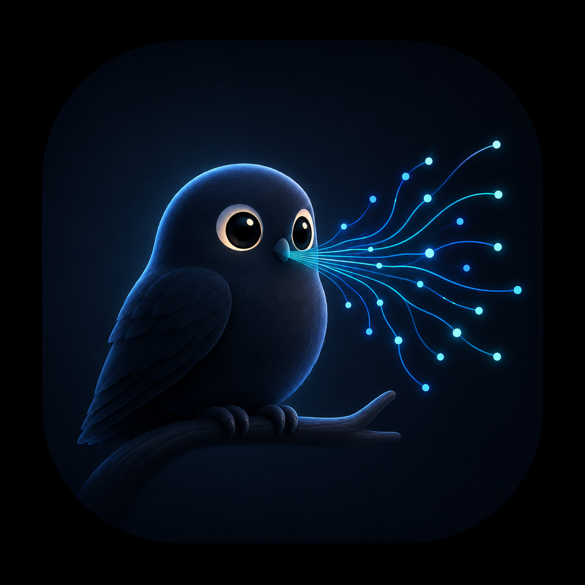

<p align="center">
  
</p>

# Murmur

Local, offline voice dictation for macOS (Apple Silicon). System-wide, with no cloud: your voice never leaves the machine.

Click the floating pill (or an optional global hotkey), speak, and the cleaned-up text is inserted at your cursor in whatever app is focused. A history window keeps your dictations so you can copy, re-insert, or regenerate any of them.

## Fully local, private by design

- Audio is captured, transcribed, and cleaned up entirely on your Mac. Nothing is sent anywhere.
- Release builds never write your dictated words to any log file.
- History (text + optional audio) lives in `~/Library/Application Support/Murmur/`, on your disk only, with automatic retention pruning.

## How it works

Four-stage local pipeline, each stage on the right piece of Apple Silicon:

1. **Capture**: `AVAudioEngine` records mic audio on trigger.
2. **Transcribe**: [FluidAudio](https://github.com/FluidInference/FluidAudio) runs NVIDIA Parakeet via CoreML on the **Apple Neural Engine** (~66 MB, leaves the GPU free).
3. **Clean up**: a small local LLM served by **Ollama** (on the GPU) fixes punctuation, removes filler words, and formats. It reformats; it never answers. Recent dictations are fed back as context so it learns your vocabulary (e.g. proper nouns) automatically.
4. **Inject**: pasteboard-then-paste (`CGEvent` ⌘V) drops the text at the cursor.

Because ASR sits on the Neural Engine and the LLM on the GPU, both stay resident with no contention even on a 24 GB machine.

## Models: nothing bundled

**No model weights are bundled with Murmur.**

- The ASR model (NVIDIA Parakeet TDT, CC-BY-4.0) is downloaded by FluidAudio on first run.
- The cleanup LLM is served by your local Ollama install. Murmur picks `llama3.2:3b` (Meta Llama Community License) on smaller machines and `qwen2.5:7b` (Apache-2.0) on machines with more than 32 GB of RAM; you can override the model in Settings.

Each model carries its own license, accepted when you download it. See `NOTICE` for attributions.

## Build & run

Requirements: macOS 14+, Apple Silicon, [xcodegen](https://github.com/yonaskolb/XcodeGen), and a running [Ollama](https://ollama.com) (`ollama serve`, with at least one model pulled, e.g. `ollama pull llama3.2:3b`).

```sh
scripts/build.sh   # xcodegen generate + xcodebuild (Debug)
scripts/run.sh     # launch the built Murmur.app
```

### Permissions

- **Microphone**: prompted on first recording.
- **Accessibility**: required for the paste injection (System Settings > Privacy & Security > Accessibility). Without it, dictations still land in History; they just can't be auto-inserted.
- The optional global hotkey uses a system hotkey registration and needs no Input Monitoring permission.

## Targets

- Apple **M4 / 24 GB**: tight-memory target; cleanup model `llama3.2:3b`.
- Apple **M5 Max / 64 GB**: cleanup model auto-steps up to `qwen2.5:7b`.

## License

MIT (see `LICENSE`). Third-party attributions in `NOTICE`.

## Prior art (read, not forked)

Handy (MIT), VoiceInk (GPL-3.0), local-whisper, OpenWhispr (MIT). Built fresh in Swift to keep the stack native, memory-frugal, and free of copyleft.
