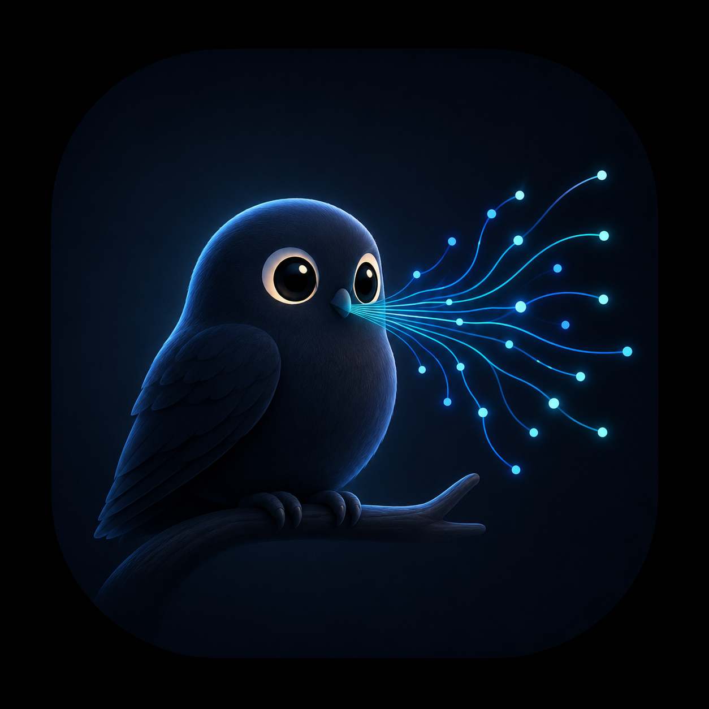

<p align="center">
  
</p>

# Murmur

Local, offline voice dictation for macOS (Apple Silicon). System-wide, with no cloud: your voice never leaves the machine.

Click the floating pill (or an optional global hotkey), speak, and the cleaned-up text is inserted at your cursor in whatever app is focused. A history window keeps your dictations so you can copy, re-insert, or regenerate any of them.

## Fully local, private by design

- Audio is captured, transcribed, and cleaned up entirely on your Mac. Nothing is sent anywhere unless you turn on Vault Capture (below).
- Release builds never write your dictated words to any log file.
- The optional update check (off by default, Settings > Startup) asks GitHub once a day for the latest release version and sends no dictation data.
- Optional Vault Capture (off unless you enter a URL in Settings > Vault Capture) sends dictations that start with "note to self" to that server, and nothing else. See [Vault Capture](#vault-capture).
- History (text + optional audio) lives in `~/Library/Application Support/Murmur/`, on your disk only, with automatic retention pruning.

## How it works

Four-stage local pipeline, each stage on the right piece of Apple Silicon:

1. **Capture**: `AVAudioEngine` records mic audio on trigger.
2. **Transcribe**: [FluidAudio](https://github.com/FluidInference/FluidAudio) runs NVIDIA Parakeet via CoreML on the **Apple Neural Engine** (~66 MB, leaves the GPU free).
3. **Clean up** (optional): a small local LLM served by **Ollama** (on the GPU) fixes punctuation, removes filler words, and formats — it reformats, never answers. Three modes in Settings: **Off** (the default on every Mac — the raw transcript is injected instantly, no Ollama involved), **Light** (LLM cleanup, no history context), and **Full** (recent dictations are fed back as context so it learns your vocabulary, e.g. proper nouns, automatically).
4. **Inject**: pasteboard-then-paste (`CGEvent` ⌘V) drops the text at the cursor.

Because ASR sits on the Neural Engine and the LLM (when cleanup is on) on the GPU, both stay resident with no contention even on a 24 GB machine.

## Vault Capture

Vault Capture is an opt-in way to send spoken notes to a server you run instead of pasting them. It was built for a personal notes backend, but any server that implements the contract below works.

- **Off by default.** It does nothing until you enter a URL in Settings > Vault Capture. Clear the field to turn it off.
- **What is sent.** Only dictations whose raw transcript starts with "note to self" (case-insensitive, followed by a space, comma, colon, period, or nothing). The prefix is stripped and the rest of the text (after cleanup, if cleanup is on) is sent. Every other dictation is pasted as usual and never leaves the Mac. Audio is never sent.
- **Contract.** `POST {your URL}/capture` with `Content-Type: application/json` and body `{"text": "..."}`. Any 2xx response counts as success. Anything else, or a network error or a 10 second timeout, falls back to pasting the transcript (prefixed with `note to self: `) so nothing is lost.
- **Transport.** The URL must be `https`. Plain `http` is accepted only for `localhost`, a Tailscale `*.ts.net` name, or a Tailscale `100.64.0.0/10` address, where the link is already private.

## Models: nothing bundled

**No model weights are bundled with Murmur.**

- The ASR model (NVIDIA Parakeet TDT, CC-BY-4.0) is downloaded by FluidAudio on first run.
- When cleanup is on (Light/Full mode), the LLM is served by your local Ollama install. Murmur picks `llama3.2:3b` (Meta Llama Community License) on smaller machines and `qwen2.5:7b` (Apache-2.0) on machines with more than 32 GB of RAM; you can override the model in Settings.

Each model carries its own license, accepted when you download it. See `NOTICE` for attributions.

## Install

Requires macOS 14+ on Apple Silicon. With [Homebrew](https://brew.sh):

```sh
brew install --cask costajohnt/tap/murmur
```

`brew upgrade` picks up new releases. Without Homebrew, one command:

```sh
curl -fsSL https://raw.githubusercontent.com/costajohnt/murmur/main/install.sh | bash
```

That downloads the latest release, installs it to `/Applications`, and clears
the quarantine flag (see below). Set `INSTALL_DIR` to put it somewhere else.

Prefer to do it by hand? Download `Murmur-<tag>.zip` from the
[releases page](https://github.com/costajohnt/murmur/releases), unzip it, drag
`Murmur.app` to `/Applications`, then run:

```sh
xattr -dr com.apple.quarantine /Applications/Murmur.app
```

On first launch, grant Microphone and Accessibility permissions when prompted.

### Releases: self-signed, not notarized

Tagged releases are signed by CI with a long-lived self-signed certificate
(`scripts/sign-release.sh`). Every release carries the same signing identity,
so macOS keeps your Microphone and Accessibility grants when you upgrade
(releases up to v1.3.0 were ad-hoc signed, so the first upgrade past them asks
once more).

There is no Apple Developer Program membership behind this project, so builds
are not notarized. Without the quarantine flag cleared, macOS Gatekeeper
refuses the first launch; the Homebrew cask and `install.sh` both clear it.
Building from source avoids the warning entirely.

## Build & run

Requirements: macOS 14+, Apple Silicon, [xcodegen](https://github.com/yonaskolb/XcodeGen). [Ollama](https://ollama.com) is optional — only needed if you turn on Light or Full cleanup mode in Settings (`ollama serve`, with at least one model pulled, e.g. `ollama pull llama3.2:3b`).

```sh
scripts/build.sh   # xcodegen generate + xcodebuild (Debug)
scripts/run.sh     # launch the built Murmur.app
```

Ad-hoc builds change identity on every rebuild, so macOS asks for
Microphone and Accessibility again each time. Run
`scripts/create-signing-cert.sh` once: it makes a local self-signed
"Murmur Dev Signing" cert (no Keychain Access steps), and `build.sh` signs
with it from then on so the grants stick.

### Permissions

- **Microphone**: prompted on first recording.
- **Accessibility**: required for the paste injection (System Settings > Privacy & Security > Accessibility). Without it, dictations still land in History; they just can't be auto-inserted.
- The optional global hotkey uses a system hotkey registration and needs no Input Monitoring permission.

## Targets

- Apple **M4 / 24 GB**: tight-memory target; cleanup mode defaults to **Off** (raw transcript, instant). Switching to Light/Full in Settings uses `llama3.2:3b`.
- Apple **M5 Max / 64 GB**: cleanup mode also defaults to **Off**; switching to Light/Full uses `qwen2.5:7b`.

## License

MIT (see `LICENSE`). Third-party attributions in `NOTICE`.

## Prior art (read, not forked)

Handy (MIT), VoiceInk (GPL-3.0), local-whisper, OpenWhispr (MIT). Built fresh in Swift to keep the stack native, memory-frugal, and free of copyleft.
